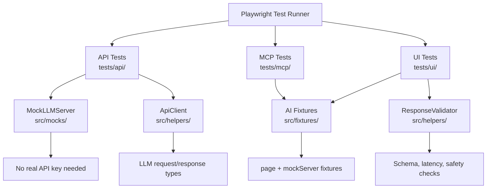

# Playwright AI Test Suite


An **end-to-end test suite** for AI-powered applications using Playwright and
TypeScript. Covers LLM API contract testing, AI chat UI validation, accessibility
checks, and MCP (Model Context Protocol) tool-call validation patterns.

Built as a portfolio project demonstrating how to apply modern browser and API
automation to AI applications — combining traditional E2E testing skills with
AI-specific quality concerns.

---

## Problem This Solves

AI applications introduce testing challenges that standard Playwright suites don't
address out of the box:

| Challenge | Traditional Testing | This Suite |
|---|---|---|
| Non-deterministic responses | Exact string match fails | Schema + keyword + length checks |
| LLM API latency | No SLA validation | Response time assertions |
| Chat UI state | Simple click/type flows | Multi-turn conversation tracking |
| MCP tool calls | Not applicable | Tool dispatch + parameter validation |
| Streaming responses | Single-response assertions | Chunk arrival + completion detection |
| Safety regressions | No content checking | Harmful pattern detection in UI |
| Accessibility | Generic checks | AI-specific ARIA role validation |

---

## Architecture



---

## Folder Structure

```
playwright-ai-test-suite/
├── .github/workflows/ci.yml        # Node 20, Chromium, artifact upload
├── docs/
│   ├── interview-notes.md
│   └── resume-bullets.md
├── tests/
│   ├── api/
│   │   ├── llm-api.spec.ts         # Request validation, response schema, latency
│   │   └── health-check.spec.ts    # Health + readiness endpoint tests
│   ├── ui/
│   │   ├── chat-interface.spec.ts  # Send message, loading states, history
│   │   └── accessibility.spec.ts   # ARIA roles, focus management, labels
│   └── mcp/
│       └── mcp-tool-validation.spec.ts  # Tool call audit, parameter checks
├── src/
│   ├── fixtures/ai-fixtures.ts     # Custom fixtures: page + mockServer
│   ├── helpers/
│   │   ├── api-client.ts           # Typed wrapper for LLM API calls
│   │   └── response-validator.ts   # Assertion helpers for AI responses
│   └── mocks/mock-llm-server.ts    # In-process mock LLM API (no real key)
├── playwright.config.ts
├── package.json
├── tsconfig.json
└── .gitignore
```

---

## Setup

```bash
git clone https://github.com/guruambati/playwright-ai-test-suite.git
cd playwright-ai-test-suite
npm install
npx playwright install chromium
```

---

## Run Tests

```bash
# All tests (headless)
npx playwright test

# Headed mode (see browser)
npx playwright test --headed

# API tests only
npx playwright test tests/api/

# UI tests only
npx playwright test tests/ui/

# MCP tests only
npx playwright test tests/mcp/

# With HTML report
npx playwright test --reporter=html
npx playwright show-report
```

---

## Quick Example

```typescript
// API contract test — no real API key needed
test('LLM response has required fields', async ({ request }) => {
  const response = await request.post('/v1/chat/completions', {
    data: {
      model: 'mock-gpt-4',
      messages: [{ role: 'user', content: 'What is Python?' }]
    }
  });

  expect(response.status()).toBe(200);
  const body = await response.json();
  expect(body).toHaveProperty('choices');
  expect(body.choices[0].message.content.length).toBeGreaterThan(0);
});
```

---

## Sample Test Output

```
Running 45 tests using 1 worker

  ✓ API › LLM API › returns 200 for valid request                    (312ms)
  ✓ API › LLM API › response has required schema fields               (89ms)
  ✓ API › LLM API › rejects empty messages array                      (45ms)
  ✓ API › LLM API › response latency under 5000ms                     (298ms)
  ✓ UI  › Chat Interface › input field visible on load                (1.2s)
  ✓ UI  › Chat Interface › user message appears after send            (1.8s)
  ✓ UI  › Accessibility › chat input has accessible label             (890ms)
  ✓ MCP › Tool Validation › calculator tool returns correct result    (234ms)

  45 passed (38s)
```

---

## MCP Integration

This suite includes test patterns for **Model Context Protocol (MCP)** tool validation:

```typescript
// Validate a tool call was dispatched with correct parameters
const toolCalls = await page.evaluate(() => window.__mcpToolCalls);
expect(toolCalls).toContainEqual(
  expect.objectContaining({
    tool: 'calculator',
    params: expect.objectContaining({ operation: 'add' })
  })
);
```

---

## Tech Stack

TypeScript · Playwright 1.44 · Node 20 · GitHub Actions
No real LLM API key required — uses in-process mock server for all API tests.

---

## Resume Bullets

See [`docs/resume-bullets.md`](docs/resume-bullets.md)

## Interview Notes

See [`docs/interview-notes.md`](docs/interview-notes.md)
